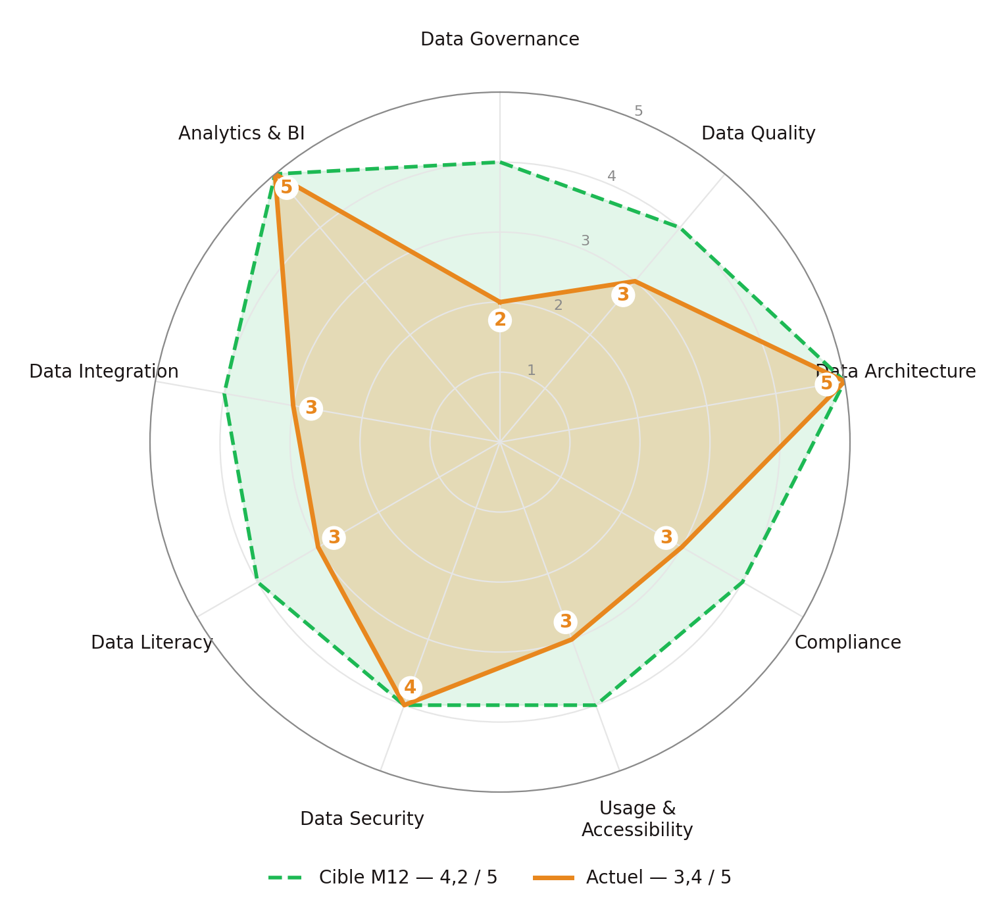

**Périmètre** : opérations data globales de Spotify (450 M d'utilisateurs actifs, 200 M d'abonnés premium, 180+ pays).
**Méthode** : Data Maturity Assessment Template (9 dimensions, échelle 1-5) + analyse du business case.

> **Hypothèses de travail.** Ce rapport est réalisé sans accès aux données internes de Spotify. Les éléments suivants sont des hypothèses fondées sur des sources publiques (blog Spotify Engineering, rapports annuels, décision IMY 2023) et devront être validés en phase 1 du plan d'implémentation : infrastructure GCP/BigQuery (migration publique depuis 2016), catalogue interne Lexikon, existence d'un DPO, délégation des paiements à un prestataire certifié PCI-DSS, part de métadonnées de contenu incomplètes.

## 1. Verdict global : 3,4 / 5 — « Proactive » incomplet

Sur l'échelle du cours (Aware → Reactive → Managed → **Proactive** → Effective), Spotify se situe entre **Managed** et **Proactive** : les processus data existent et l'infrastructure est de niveau « Effective », mais la gouvernance formelle, la conformité multi-juridictions et la data literacy hors équipes techniques restent en retrait. La moyenne des 9 dimensions est de **3,4 / 5**.

Le signal le plus concret : en juin 2023, l'autorité suédoise (IMY) a sanctionné Spotify de **58 M SEK (≈ 5 M€)** pour un droit d'accès GDPR insuffisamment clair — une défaillance de gouvernance (information sur les durées de conservation et les transferts), pas d'infrastructure.

## 2. Évaluation par dimension

| Dimension | Actuel | Cible M12 | Forces | Faiblesses | Plan d'action |
|--------------|:-----:|:-----:|----------------------|----------------------------|----------------------|
| **Data Governance** | **2** | 4 | Besoin identifié, DPO en place (hyp.) | Pas de CDO ni d'équipe transverse ; chaque département gère ses datasets (business case) ; définitions de métriques divergentes | Nommer un CDO, créer un Centre of Excellence, désigner 5 Data Stewards |
| **Data Quality** | 3 | 4 | Validation sur les pipelines critiques (recommandation) | Métadonnées de contenu incomplètes côté labels/distributeurs indépendants (hyp.) ; pas de métriques qualité partagées | Déployer Great Expectations, 4 critères qualité par domaine, baseline mesurée |
| **Data Architecture** | 5 | 5 | GCP/BigQuery, data lakes, traitement temps réel | Systèmes hérités des acquisitions podcast (Anchor, Gimlet, Parcast) | Standardiser les pipelines des acquisitions |
| **Compliance** | 3 | 4 | DPO, politiques de base, réponse aux demandes utilisateurs | Sanction IMY 2023 (droit d'accès) ; pas de DPIA systématique ; effacement non automatisé ; PDPA/LGPD non formalisés | DPIA obligatoires, pipeline d'effacement < 30 j, OneTrust multi-juridictions |
| **Data Usage & Accessibility** | 3 | 4 | Culture A/B testing, catalogue Lexikon (adoption 95 % des data scientists) | Silos Marketing / Product / Engineering / Content ; pas de vision unifiée du parcours utilisateur | Étendre le catalogue à tous les domaines, règles d'accès par classification |
| **Data Security** | 4 | 4 | Chiffrement en transit, contrôle d'accès, paiements délégués (PCI-DSS) | Classification des données sensibles incomplète ; pas de SIEM unifié (hyp.) | Classification 4 niveaux, SIEM Splunk |
| **Data Literacy** | 3 | 4 | Forte dans les squads produit et data | Faible maîtrise des principes de gouvernance et conformité en Marketing, Legal, Content | Formation par rôle, e-learning obligatoire |
| **Data Integration** | 3 | 4 | Pipelines inter-systèmes opérationnels | Intégration incomplète des podcasts ; pas de lineage de bout en bout | OpenLineage + Marquez, pipelines standardisés |
| **Analytics & BI** | 5 | 5 | Moteur de recommandation ML de référence (Discover Weekly, Daily Mix), A/B testing massif | Biais et explicabilité des recommandations non audités (obligation DSA art. 27) | Audit trimestriel des biais, explicabilité utilisateur |

{width=8.5cm}

## 3. Challenges prioritaires

**1. Gouvernance sans structure — URGENT.** Pas de CDO, pas d'ownership transverse : les décisions data sont prises département par département. Symptôme : « utilisateur actif » n'a pas la même définition en Marketing et en Product. Le business case le formule ainsi : *« different departments manage their own datasets independently »*.

**2. Conformité multi-juridictions — URGENT.** Exposition simultanée au GDPR (jusqu'à 20 M€ ou **4 % du CA mondial**, soit ≈ 530 M€ sur un CA 2023 de 13,25 Md€ ; notification de violation sous 72 h), au CCPA/CPRA, au PDPA (Singapour), à la LGPD (Brésil) et au DSA (transparence des recommandations). La sanction IMY 2023 montre que le risque n'est pas théorique.

**3. Silos inter-départements — HAUTE.** Marketing, Product, Engineering et Content gèrent des datasets séparés. Reconstituer le parcours découverte → conversion premium exige de croiser des données aujourd'hui inaccessibles. Conséquences : analyses incomplètes, doublons, features retardées.

**4. Qualité des données — HAUTE.** Métadonnées de contenu incomplètes ou erronées (ISRC, droits, genres) et données comportementales capturées de façon inconsistante dégradent la recommandation, la distribution des royalties et le reporting. Face à Apple Music, Amazon Music et YouTube Music, la qualité de la recommandation est un facteur direct de rétention.

**5. Privacy et éthique algorithmique — HAUTE.** Les utilisateurs et régulateurs attendent transparence, anonymisation quand c'est possible et contrôle sur les données (opt-out, effacement). Les historiques d'écoute peuvent révéler des informations sensibles inférées (humeur, convictions) et la recommandation n'est pas auditée pour les biais.

## 4. Cibles à 12 mois

Priorités : **urgente** pour Data Governance (2 → 4) et Compliance (3 → 4) ; **haute** pour Data Quality, Usage & Accessibility et Data Literacy (3 → 4) ; **moyenne** pour Data Integration ; **maintenir** Architecture, Security et Analytics (avec audit des biais).

**Score cible : 4,2 / 5** (niveau « Proactive » consolidé). Les trois dimensions les plus urgentes — Governance, Compliance, Data Quality — structurent le framework (document de politique) et le plan d'implémentation.
