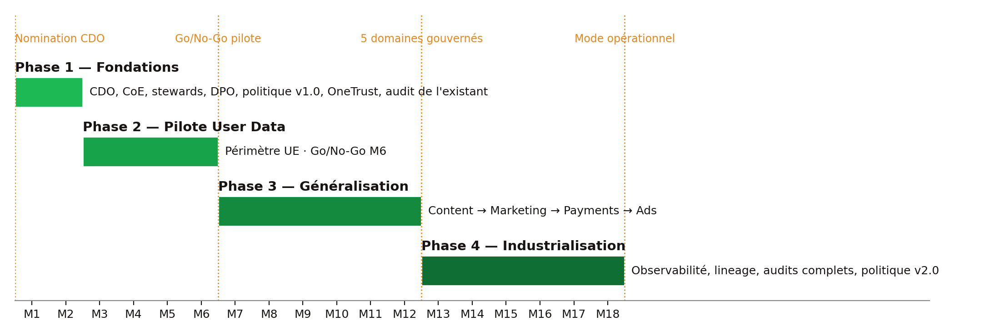

## 1. Modèle organisationnel : Centre of Excellence (CoE)

| Modèle (Organizational Models Overview) | Avantages | Failles | Verdict pour Spotify |
|------------------|------------------------|--------------------------|------------------------------|
| **Centralisé** | Simple, priorisation claire | Les métiers ne s'approprient pas la donnée ; goulot d'étranglement | Non : 180+ pays, squads autonomes |
| **Embedded** | Agile, proche du métier | Pas de source unique de vérité, silos | Non : c'est le modèle de fait actuel, il produit les silos constatés |
| **Centre of Excellence** | Cumule les deux ; standards communs + relais dans chaque BU | Réservé aux grandes entreprises ; couche de coordination supplémentaire | **Oui** : Spotify est une grande entreprise ; la coordination est assurée par le Committee mensuel |

Le CoE (4-6 personnes sous le CDO) porte les standards, le catalogue, la formation et l'audit ; les 5 Data Stewards sont les relais dans les business units. Conformément au cours, **gouvernance et data management sont séparés** : le CoE définit et audite, l'engineering (CTO) implémente.

## 2. Stack technologique

Un outil par besoin, choisi dans le Tech Tools Overview selon trois critères : intégration avec l'existant GCP/Airflow, coût, couverture fonctionnelle. Spotify dispose déjà d'un catalogue interne (Lexikon) : la phase 1 audite l'existant avant tout achat.

| Besoin | Outil retenu | Pourquoi | Alternative évaluée |
|------------------|------------------------|----------------------------------------|------------------|
| Catalogue & stewardship | **Collibra** (ou extension de Lexikon) | Workflows de stewardship, glossaire, classification, intégration BigQuery | Alation, Apache Atlas |
| Qualité des données | **Great Expectations** | Open source, tests dans les pipelines Airflow existants, coût nul en licence | Talend |
| Conformité & consentement | **OneTrust** | Consentement multi-pays, registre, DPIA, gestion des demandes des personnes | TrustArc |
| Sécurité (SIEM) | **Splunk** | Journalisation centralisée, détection d'incidents | DataGuard |
| Chiffrement & clés | **Vormetric (Thales CipherTrust)** | Chiffrement des données sensibles au repos, gestion des clés | — |
| Lineage | **OpenLineage + Marquez** | Standard ouvert compatible Airflow, traçabilité de bout en bout | — |
| Observabilité (phase 4) | **Monte Carlo** | Détection d'anomalies et de fraîcheur | Ataccama ONE |

## 3. Plan en 4 phases (18 mois)

Calendrier conforme à l'Executive Q&A Guide : pilote de 3 à 6 mois, puis 12 mois de déploiement.

{width=15cm}

**Phase 1 — Fondations (M1-M2).** Prérequis bloquant : nomination du CDO. Puis : constitution du CoE et désignation des 5 Data Stewards (fiches signées) ; confirmation du DPO et création de la Privacy Team ; approbation de la politique v1.0 par le Committee ; audit de l'existant (Lexikon, pipelines, consentement) ; déploiement OneTrust et instance pilote du catalogue ; cartographie des flux User Data ; communication de lancement (message CEO, webinar CDO, FAQ par rôle) et e-learning obligatoire. *Critère de sortie* : équipe en place, politique approuvée, baseline de mesure prête.

**Phase 2 — Pilote User Data (M3-M6).** Voir section 4. *Critère de sortie* : Go/No-Go du Committee sur les KPIs.

**Phase 3 — Généralisation (M7-M12).** Déploiement domaine par domaine, dans l'ordre de priorité du business case : **Content** (métadonnées, royalties), **Marketing** (consentement, métriques de conversion), **Payments** (PCI-DSS, chiffrement), **Ads** (opt-out CCPA/CPRA). Pour chaque domaine : cartographie → classification et durées de conservation → règles qualité dans les pipelines → DPIA si nécessaire → baseline puis cibles. Extension du pilote User Data des marchés UE au monde. *Critère de sortie* : 5 domaines catalogués et mesurés.

**Phase 4 — Industrialisation (M13-M18).** Observabilité (Monte Carlo), lineage de bout en bout, audit de conformité complet (GDPR/CCPA/PCI-DSS) et audit complet des biais de recommandation, formation avancée par rôle, tableau de bord exécutif, revue annuelle de la politique (v2.0). *Critère de sortie* : mode opérationnel continu, score de maturité ≥ 4,2.

## 4. Pilote User Data (Pilot Implementation Template)

| | |
|----------------|--------------------------------------------------------------------------------|
| **Projet** | Pilote du framework de Data Governance — domaine User Data |
| **Période** | M3 → M6 (4 mois) |
| **Préparé par** | Emeline ROBLOT, Data Governance Specialist |
| **Project Manager** | Lead du Data Governance CoE |
| **Sponsor** | CDO |

**Objectif et périmètre.** Tester le framework complet (politique, rôles, outils, KPIs) sur le domaine le plus sensible et le plus créateur de valeur : les données utilisateurs. Périmètre borné pour être réaliste en 4 mois : **profils et historiques d'écoute des marchés UE** (juridiction la plus exigeante, sanction IMY 2023), extension mondiale en phase 3. Pourquoi User Data : exposition GDPR maximale, données pouvant révéler des informations sensibles inférées, impact direct sur Discover Weekly et la rétention premium.

**Key goals (template).** (1) Qualité : complétude et cohérence des données utilisateurs ; (2) Conformité GDPR/CCPA : droits des personnes et consentement ; (3) Accès et intégration : réduire les silos entre Product, Marketing et Engineering ; (4) Risque : classification, chiffrement, protocole d'incident testé.

**Équipe.**

| Rôle | Responsabilités |
|----------------------------------|--------------------------------------------------------------|
| Pilot Project Manager (Lead CoE) | Pilotage, coordination, reporting au Committee |
| Data Steward User | Qualité, classification, règles Great Expectations, catalogue |
| DPO + Privacy Team | Audit de conformité, DPIA, test du pipeline de droits |
| Data Engineers (Head of Engineering) | Intégration outils, pipeline d'effacement, pseudonymisation |
| Department Head (VP Product / User Experience) | Alignement métier, arbitrage des priorités, adoption |

**Jalons.**

| Jalon | Date | Responsable |
|----------------------------------------------------|----------------|----------------------------|
| Kick-off et mesure des baselines | M3 s1 | Project Manager |
| Data assessment et cleansing (périmètre UE) | M3 s2 → M4 s2 | Data Steward User |
| Audit de conformité GDPR/CCPA et DPIA | M4 | DPO |
| Setup technique : catalogue, Great Expectations, pipeline d'effacement | M4 → M5 s2 | Data Engineers |
| Revue à mi-parcours et ajustements | M5 s2 | Project Manager |
| Premier audit des biais de recommandation | M5 s3-4 | Head of Engineering + DPO |
| Revue finale, lessons learned, Go/No-Go | M6 s4 | Project Manager → Committee |

**Livrables** : Data Quality Report · Compliance Assessment · Technical Integration Plan · Risk Assessment Report · Stakeholder Feedback.

**KPIs.** Toutes les baselines sont mesurées en M3 semaine 1.

| KPI | Définition | Baseline | Cible M6 | Source |
|----------------|----------------------------------------|----------|--------------------------|--------------|
| Data Quality Score | % de champs obligatoires manquants sur les datasets critiques User | à mesurer | **-10 %** de données manquantes (complétude > 98 %) | Great Expectations |
| Compliance Score | % de traitements User avec base légale documentée et consentement valide quand requis | à mesurer | **100 %** | OneTrust |
| Data Access Speed | Délai médian entre demande d'accès à un dataset et accès effectif | à mesurer | **-20 %** | Catalogue |
| Risk Mitigation Score | Datasets User classifiés et chiffrés selon leur classe ; incidents | à mesurer | 100 % classifiés, **0 incident** | Catalogue, Splunk |
| Droits des personnes | Délai de traitement d'une demande d'effacement / d'accès | à mesurer | **< 30 jours**, 100 % dans le délai légal | Privacy Team |

**Risques du pilote.**

| Risque | Prob. | Impact | Mitigation |
|----------------------------------|---------|---------|--------------------------------------------|
| Non-conformité résiduelle GDPR/CCPA | Moyenne | Élevé | Audit DPO en M4, formation, DPIA avant toute mise en production |
| Résistance au changement des squads | Élevée | Moyen | Ateliers dès M1, stewards issus des équipes, quick wins publiés |
| Qualité non améliorée | Faible | Élevé | Monitoring continu, revue à mi-parcours |
| Intégration technique (catalogue ↔ BigQuery, pipeline d'effacement) | Moyenne | Élevé | Engineering impliqué dès M1, POC en phase 1 |
| Périmètre qui dérive | Moyenne | Moyen | Périmètre UE borné, changements validés par le Committee |

**Formation et conduite du changement.** Ateliers pratiques pour les équipes User Data (catalogue, règles qualité, droits des personnes) ; documentation et helpdesk du CoE ; canal de feedback hebdomadaire → ajustements ; résultats du pilote publiés en interne comme quick wins.

**Évaluation et lessons learned.** Go/No-Go en M6 sur les KPIs ; rapport de retour d'expérience (ce qui a marché, blocages, temps réel vs estimé) ; feedback structuré des stakeholders ; ajustement de la politique et du plan de généralisation avant la phase 3.

## 5. Ressources et budget (ordres de grandeur, hypothèses à affiner en phase 1)

| Poste | Hypothèse | 18 mois |
|--------------------------------------------------|------------------------------|--------------|
| Personnel CoE (5 ETP) + Privacy Team (3 ETP) + 5 stewards à 50 % (2,5 ETP) | ≈ 10,5 ETP × 120 k€ chargés / an | ≈ 1,9 M€ |
| Licences (catalogue, consentement, SIEM, chiffrement, observabilité) | 1,5 à 2,5 M€ / an | ≈ 3 M€ |
| Intégration et conseil (setup, pipelines d'effacement, migration) | Forfait | 0,5 à 1 M€ |
| Formation et communication | E-learning, ateliers, supports | ≈ 0,3 M€ |
| **Total programme** | | **≈ 6 à 7 M€ sur 18 mois** |

À comparer à l'exposition maximale GDPR (4 % de 13,25 Md€ ≈ **530 M€**), à la sanction déjà subie en 2023 (≈ 5 M€) et au gain d'efficacité : à titre d'hypothèse, 500 analystes et data scientists gagnant 2 h par semaine de recherche de données représentent ≈ 50 000 h/an, soit ≈ 25 ETP (≈ 3 M€/an).

## 6. KPIs de suivi du programme

| KPI | Cible | Owner |
|----------------------------------------------------|------------------------------|--------------------|
| Complétude des datasets critiques (tous domaines) | > 98 % (mensuel) | Data Stewards |
| Demandes des personnes traitées dans le délai légal ; notification de violation | 100 %, effacement < 30 j ; < 72 h | DPO / Privacy Team |
| Traitements avec base légale documentée | 100 % (trimestriel) | DPO |
| Couverture du catalogue (classifié, owner, durée de conservation) | 100 % des 5 domaines à M12 | CoE |
| Délai d'accès aux données ; employés formés | -20 % vs baseline ; > 90 % | CoE |
| Incidents de données critiques ; audit des biais | 0 ; trimestriel, 0 biais critique | Head of Engineering + DPO |
| Score de maturité | 3,4 → 4,2 à M12 (semestriel) | CDO |

**Gouvernance du programme** : le Data Governance Committee est le comité de pilotage (Go/No-Go de chaque phase) ; le CDO rend compte trimestriellement au comité exécutif. Dépendances : nomination du CDO (M1) → tout le reste ; approbation du budget phases 1-2 avant M1 ; disponibilité des Data Engineers dès M1.
